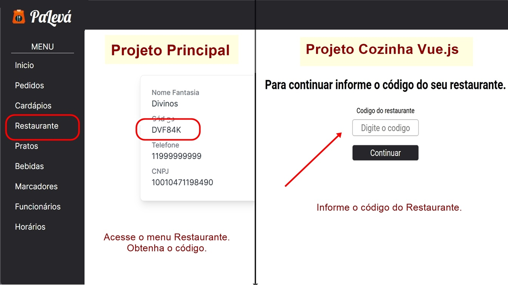

# Projeto Gestão de Pedidos Take Away (PaLevá) - Front-End Vue.js

Este Front-End é um sistema que consome a API do projeto principal [Take Away](https://github.com/WillianDDaniel/take-away). Para utilizá-lo, é necessário que o projeto principal esteja baixado e configurado em sua máquina.

Ambos os projetos precisam estar em execução simultaneamente para o correto funcionamento deste sistema.

Para mais informações sobre como baixar e executar o projeto principal, [clique aqui](https://github.com/WillianDDaniel/take-away).

## Sobre este projeto

Trata-se de um aplicativo Front-End desenvolvido em Vue.js para o atendimento e gestão de pedidos na cozinha do restaurante. Com ele, os responsáveis pela cozinha podem visualizar os pedidos, aceitá-los e marcá-los como prontos, tornando o processo mais eficiente e a organização da cozinha muito mais prática.

### Funcionalidades

- Cadastro do restaurante utilizando um código alfanumérico único.
- Exibição de uma lista com todos os pedidos.
- Filtragem de pedidos por status.
- Aceitação de pedidos recebidos do sistema principal.
- Atualização do status dos pedidos.
- Visualização detalhada de cada pedido.

## Principais Tecnologias Utilizadas
- **Vue.js**: 3.5.12
- **Vite**: 5.4.10 - Ferramenta de build rápida e moderna, otimizada para desenvolvimento front-end, com suporte a hot module replacement (HMR).
- **CSS**: para estilização do frontend09

## Configuração do Projeto
Para visualizar o projeto em seu computador, siga as instruções abaixo:

1. Primeiro baixe e execute este projeto principal seguindo as instruções da página -> [clicando aqui](https://github.com/WillianDDaniel/take-away).

2. Clone este repositório e acesse o projeto:
```bash
git https://github.com/WillianDDaniel/take-away-kitchen-app.git
cd take-away-kitchen-app
```

3. Instale as dependências:
```bash
npm install
```

4. Execute o projeto:
```bash
npm run dev
```

5. Acesse o projeto no Navegador:
```bash
http://localhost:5173/
```

### Registrar o Restaurante

1. Obtenha o código do Restaurante.

Se trata de um código alfanumérico único que pode ser encontrado acessando o menu Restaurante no projeto principal. (Com o projeto principal em execução e com o usuário logado no sistema)



Na tela inicial do projeto Vue.js vai aparecer um solicitação onde será adicionado o código do restaurante.

Após adicionado o código do seu restaurante ficará salvo no localStorage. Sendo necessário clicar em sair para que o mesmo seja desvinculado do sistema.